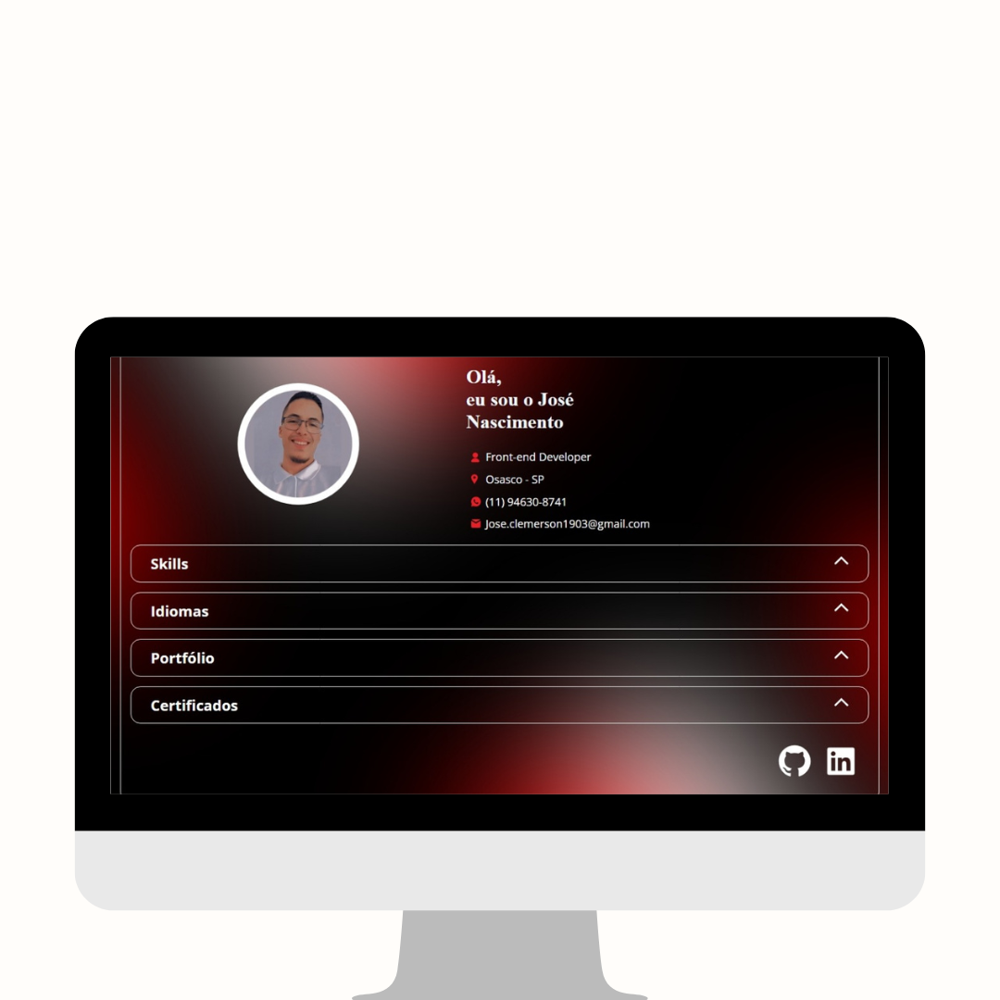
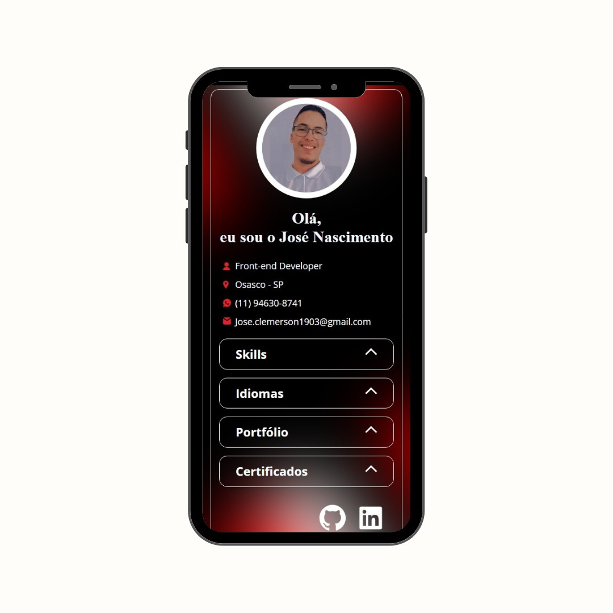
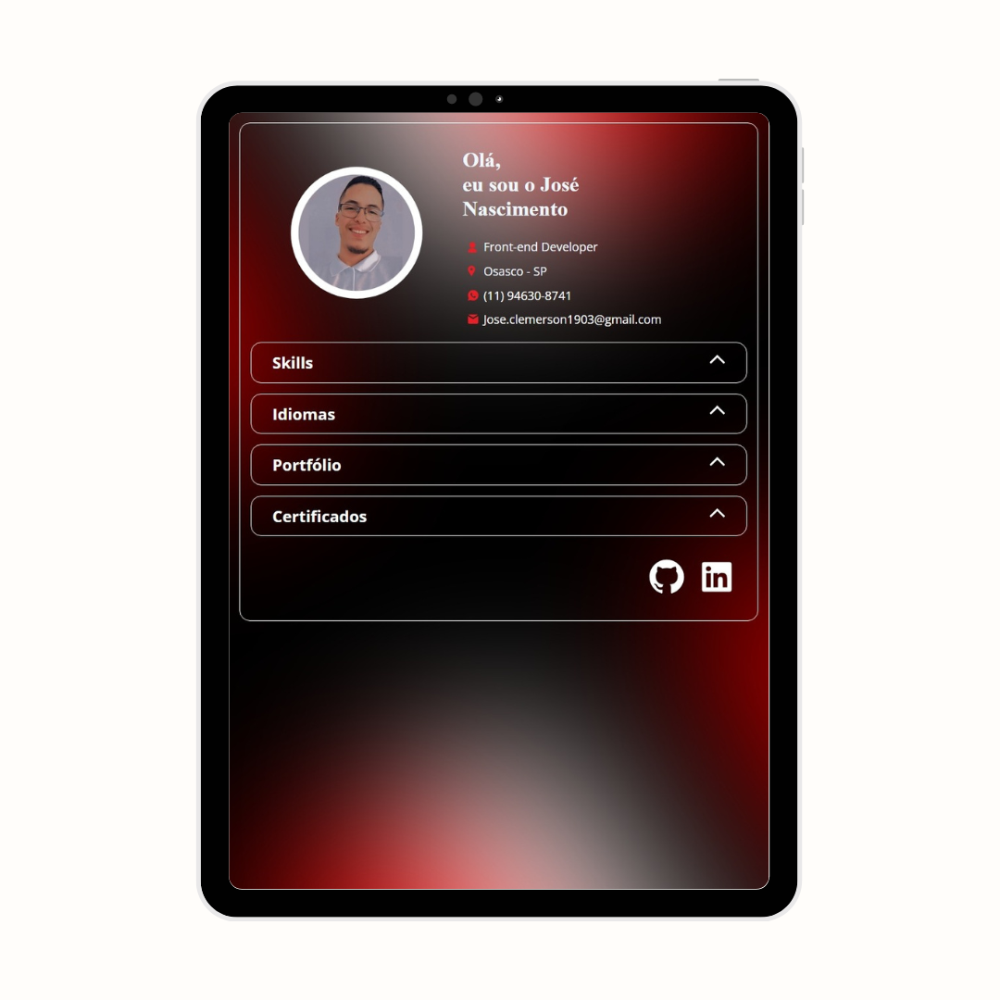

# Projeto Portfólio
Neste projeto fui desafiado a construir um portfólio. Para isso foi usado HTML5 com tags semanticas, CSS3 e JavaScript com variavéis, funções e estruturas de decisão.

🔗 [Clique aqui pra acessar o projeto](https://jose-nascimento1.web.app)

## Autor

<a href="https://www.linkedin.com/in/jose-nascimento1/">
 
  
 <b>José Nascimento</b></a> 
 
Feito por José Nascimento 👨‍💻.

